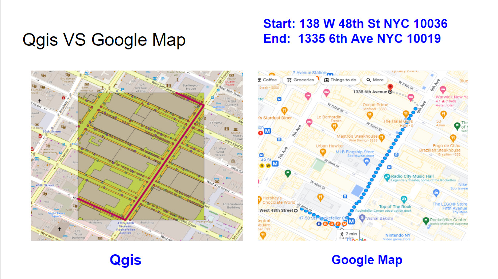

## 3D-Model-of-NYC-Sidewalk 
### Qgis Part
1. Go to the [NYC Open Data](https://opendata.cityofnewyork.us/) website download the below datasets by shapefile format. 
   - [building footprints](https://data.cityofnewyork.us/Housing-Development/Building-Footprints/nqwf-w8eh)  (download by shapefile format)
   - [sidewalk](https://data.cityofnewyork.us/City-Government/Sidewalk/vfx9-tbb6)            (download by shapefile format)
   - [bus shelter](https://data.cityofnewyork.us/Transportation/Bus-Stop-Shelters/qafz-7myz)         (download by shapefile format)
   - [city bench](https://data.cityofnewyork.us/Transportation/City-Bench-Locations-Map-/whjh-s3x7)          (download by csv format)
   - [city hydrant](https://data.cityofnewyork.us/Environment/NYCDEP-Citywide-Hydrants/6pui-xhxz)        (download by shapefile format)
   - [litter basket](https://data.cityofnewyork.us/dataset/DSNY-Litter-Basket-Map-/d6m8-cwh9)       (download by csv format)
   - [news stand](https://data.cityofnewyork.us/Transportation/Newsstands/kfum-nzw3)          (download by csv format)
   - [parking meter](https://data.cityofnewyork.us/Transportation/Parking-Meters-GPS-Coordinates-and-Status/5jsj-cq4s)       (download by shapefile format)
   - [pedestrian ramp](https://data.cityofnewyork.us/Transportation/Pedestrian-Ramp-Locations-Map-/u7ws-2dus)     (download by csv format)
   - [tree](https://data.cityofnewyork.us/Environment/2015-Street-Tree-Census-Tree-Data/pi5s-9p35)                (download by shapefile format)
   - [Road centerline](https://data.cityofnewyork.us/City-Government/NYC-Street-Centerline-CSCL-/exjm-f27b)     (download by csv format)
2. Create a folder to hold all the data which are the Qgis part outputs(extract the data within the interested area according to the user query address) 
3. Download the @Qgis-final-automatic.py 
4. Open the @Qgis-final-automatic.py on the Qgis
5. make sure to change each output path to the above folder path on the code and each input path to the path where you save the dataset(which you downloaded from the NYC Open data) on the code. 
    
    
    
6. run the @Qgis-final-automatic.py  code on the Qgis 
   - enter the start address " 138 W 48th St NYC 10036"
   - enter the end address " 33 W 54th St NYC 10019"
   
     
 
 7. After all the above steps, you will get all the shapefile format data which all within the interested area. 
   
     
   
 8. Then convert the shapefile format data into the CSV file on google collab by python before feed into the unity, this is what I did before. But you can save the data into csv file format directly on the Qgis, just change the output format .shp to .csv. 
    
    

###  Unity Part (Unity Version 2021.3.6f1)
1. Download the zip file from this github, unzip it. 
2. Open the unzip file on the unity 
3. make sure to change the file paths on all the scrips inside the script folder into the path where you save the output with CSV format from the Qgis part. (this is read all the data which got from the Qgis part into unity and generate the 3D model) 
   - Note: I only put building footprint, pedestrian ramp, tree, hydrant with different audio feedback in this 3D model, you can add as many as you want with the similar code. 
   - Note: The "Testing Code for Unity Part" folder in this repo has the testing data for the unity part. You can test the unity part with those csv data without start the Qgis part first. 
  
       
       
### some improvments
    
